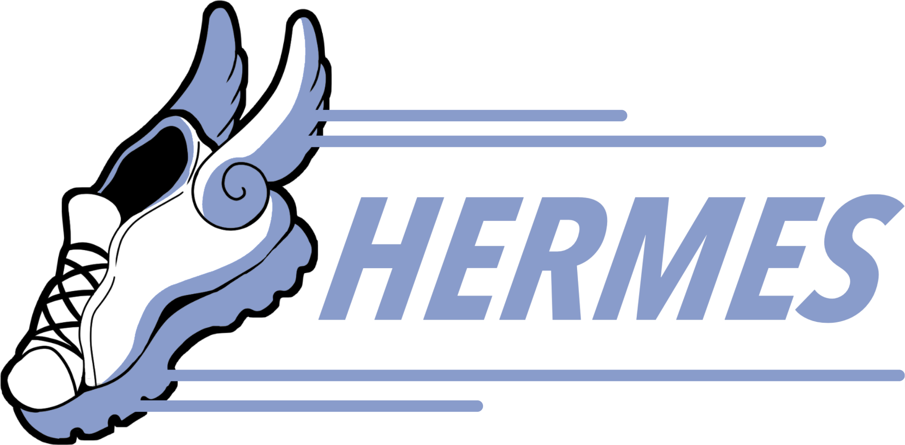

 
 

  

 
 

 

Hermes provides a single unified API for notifications.

## Powerful Templating

Hermes aims to support multiple templating frameworks including:
- Mustache templates (✓)
- Go Templates
- Django Templates
- MJML

...and many more.

## Support for Messaging Tools
- Slack (✓)
- Microsoft Teams
- Google Chat
- Discord

...and many more.

## Support for Issue Tracking Software
- JIRA (✓)
- Linear
- Trello
- GitHub Issues (✓)

...and many more.

## Immediate Roadmap
- Hermes UI: Set up templates, subscribers and user notification channels
- RabbitMQ and Beanstalkd interface
- gRPC interface
